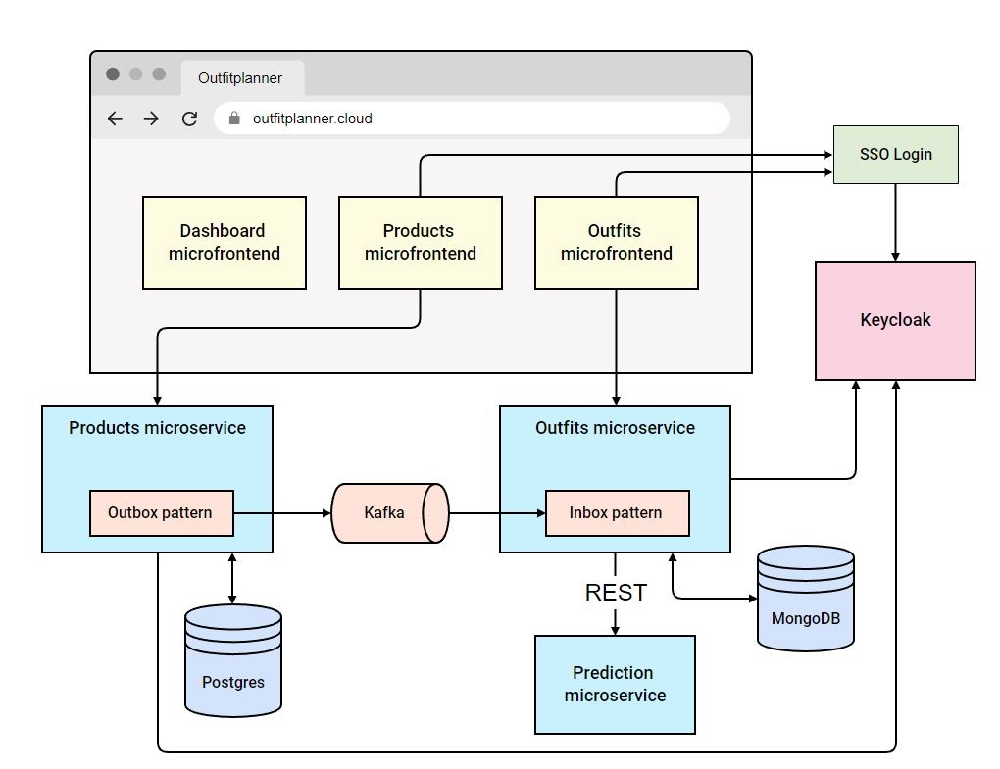

# Outfit-planner
> AI powered outfit planner.
> Live demo [_here_](https://outfitplanner.cloud).

## Table of Contents
* [Architecture overview](#architecture-overview)
* [Features](#features)
* [Setup](#setup)

## Architecture overview


## Features
List the ready features here:
* Creating a user account
* Adding clothes
* Adding outfits
* Outfit prediction based on the current weather in the user's location

## Setup
1. Set the following paths in outfit-planner-system/infrastructure/docker/.env
	* `OUTFIT_PLANNER_SYSTEM_PATH` - absolute path to the `outfit-planner-system` folder
	* `OUTFIT_PLANNER_MF_PATH` - absolute path to the `outfit-planner-mf` folder
	* `CERTS_PATH` - absolute path to the certificates folder
    * `DOCKER_SOCK_PATH` - absolute path to `docker.sock` file
    * `VOLUME_PATH` - absolute path to where docker volumes will be stored
2. Set hosts
```
127.0.0.1 products-dev
127.0.0.1 outfits-dev
127.0.0.1 dashboard-dev
```
3. Use [mkcert](https://github.com/FiloSottile/mkcert) to generate locally-trusted development certificates and put `.crt` and `.key` pairs in the `CERTS_PATH` folder
4. Create a `type` file in the `CERTS_PATH/pems` directory with the content:
```
ca-certificates
```
5. Copy all `.crt` files to `CERTS_PATH/pems` with `.pem` extension
6. Open `outfit-planner-system` folder and run
```bash
mvn install
```
7. Open `outfit-planner-system/infrastructure/docker` folder and run
```bash
docker-compose -f common.yml -f kafka_cluster.yml -f services.yml -f frontends-common.yml -f frontends-dev.yml -p outfit-planner-dev --env-file .env up -d --build
```
8. Micro-frontends should be available at:
	* https://dashboard-dev (shell)
	* https://products-dev
	* https://outfits-dev
